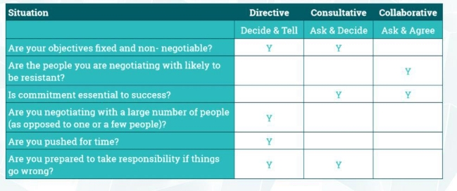

[Back to Main](../../README.md#)  
A leading question is helpful in priming and enhancing audience's receptiveness to the point    
    
    
## Communicate with others    
    
    
**Questioning**    
    
- Use an Open question to encourage engagement.    
- Use a Closed question to get a clear conclusion or keep a conversation on point.    
- Use a Probing question to get a bit more detail.    
    
**Active Listening**    
    
- Stop the Brain Train, and really listen.    
- Show you’re listening, using simple cues.    
- Summarise. Check your understanding before you move on.    
    
•    
    
## Manage conflict    
    
- *Avoiding*    
- *Competing style*    
	- *Less cooperative*    
	- *Get your own way*     
- *Accommodating Collaborating*    
    
1. **Acknowledge the Conflict**: Recognise that a conflict exists. Ignoring the problem can lead to escalation and affect team morale and productivity. Early acknowledgment helps in addressing issues before they become unmanageable.    
        
2. **Assess the Situation**: Take time to understand the root causes of the conflict. This involves gathering information from all parties involved and observing the situation impartially. Understanding the underlying issues is crucial for a successful resolution.    
        
3. **Ensure a Safe Environment for Dialogue**: Create a safe and neutral environment where all parties can share their perspectives without fear of retribution. Ensuring confidentiality and respect for all views is vital.    
        
4. **Facilitate Open Communication**: Encourage the parties involved to express their feelings, viewpoints, and needs openly and honestly. Active listening is key here; ensure that everyone feels heard and understood.    
        
5. **Identify Common Goals and Interests**: Despite the conflict, the involved parties likely share some common goals or interests. Identifying these can help shift the focus from a confrontational stance to a collaborative one.    
        
6. **Explore Solutions Together**: Involve the parties in finding a solution. This collaborative approach not only empowers the individuals involved but also often leads to more creative and acceptable solutions. Brainstorming and negotiation techniques can be useful here.    
        
7. **Agree on a Plan and Act on It**: Once a solution is identified, agree on a clear action plan that outlines who will do what and by when. Ensure that the plan is implemented effectively, with regular check-ins to monitor progress.    
        
8. **Evaluate and Follow Up**: After implementing the solution, evaluate its effectiveness. Has the conflict been resolved satisfactorily for all parties? Follow up with individuals involved to ensure that the resolution has been effective and to address any ongoing concerns.    
        
9. **Learn from the Experience**: Reflect on the conflict and the resolution process. What worked well? What could have been done differently? Use these insights to improve conflict management strategies in the future.    
        
10. **Promote a Positive Culture**: Foster an organizational culture that views conflicts as opportunities for growth rather than threats. Encourage open communication, mutual respect, and continuous learning.