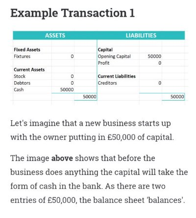
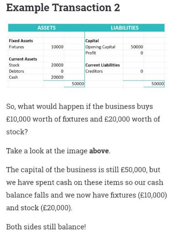
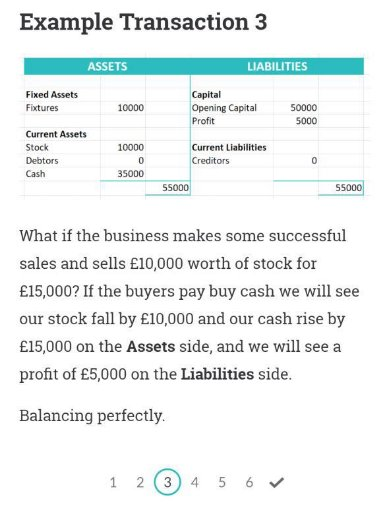
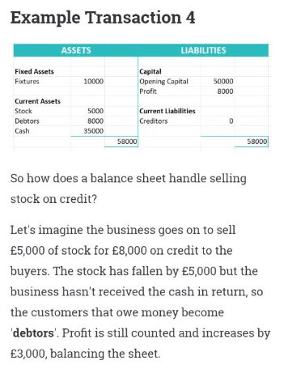
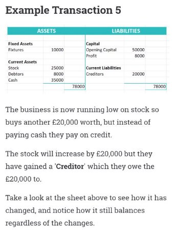
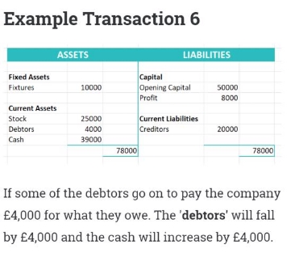
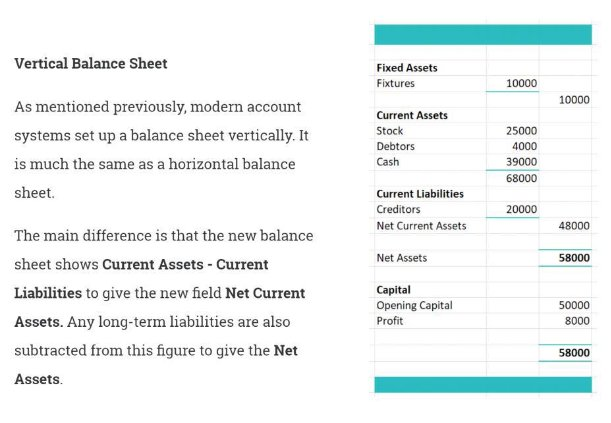
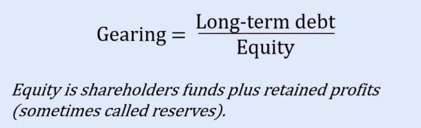
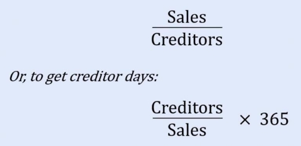

[Back to Main](../../README.md#)  
## Cash flow    
    
    
    
Opening balance Income    
    
Expenditure    
- Direct: direct related to manufacturing or service     
- Indirect: nothing to do with manufacturing     
- Capital expenditure    
    
## Break-even Analysis    
    
    
    
- Indirect cost    
    
- Direct cost    
    
- Revenue : money made through sales    
    
**Indirect cost + direct cost = revenue   is break-even point**    
    
## Final accounts    
    
### **Current assets**    
    
These are assets that tend to change in value on almost a daily basis and would typically include:    
    
- Stock.    
- Debtors (people who owe the business money).    
- Cash in the bank.    
- Cash in hand.    
- Any bills paid in advance (these are classed as an asset because they can be reclaimed if the expense is not incurred as expected).    
    
### **Fixed Assets**    
    
These are items that the business has bought that are designed for long-term use and would typically include:    
    
- Land and Buildings.    
- Furniture and Fittings.    
- Machinery.    
- Office equipment.    
- Motor Vehicles.    
    
Fixed assets are normally subject to *depreciation,* with the exception of land and buildings which may increase in value.    
    
### **Capital**    
    
    
    
Although capital might appear to be an asset of the business, it is actually money that the owner/s or shareholders have put in and, as such, it belongs to them.    
    
Capital can be increased by the owner(s) injecting new funds or by issuing additional shares, but the main way to increase capital is to make a profit and use some of this profit to grow the business.    
    
The total capital of a business (owners capital or shareholders funds plus retained profits) is referred to as the 'equity' of the business.    
    
### **Depreciation**    
    
    
    
Depreciation represents the declining value of an asset over its lifetime. A common example would be of a new car for £10,000, it will steadily lose value and within 4 years could be worth as little as £4,000. This loss of value is called depreciation.    
    
Depreciation is a non-cash expense, i.e unlike electricity or insurance you do not actually pay it in cash - it is simply a reduction in the value of an asset.    
    
In one sense, depreciation is a way for HM Revenue & Customs  to allow businesses to claim for the cost of an asset in 'instalments' rather than writing it off as one lump sum.    
    
### **Gross Profit**    
    
    
    
The gross profit is a simple formula of **total sales - total cost of goods sold.** This is not to be confused with Net Profit which will give a clearer picture of a companies performance.    
    
### **Net Profit**    
    
–    
    
Net Profit can be calculated by using the formula **gross profit - any other expenses incurred in the sale of goods.**    
    
These extra expenses could include advertising, sales staff commission, or transport of goods.    
    
### **Liabilities**    
    
–    
    
Liabilities are essentially debts and can fall into to one of two categories:    
    
**Long Term Liabilities** where the repayment period is longer than 12 months (such as bank loans and other long-term finance.    
    
Businesses often use long-term finance (debt) as a way of adding additional funds to the business, especially if they want it to grow at a faster rate.    
    
**Current Liabilities** are short-term debts and would include *creditors (*suppliers that you have bought things from on credit) and *accruals* (expenses that apply to the current financial year but will not be paid until the next one).    
    
## Trading account    
    
    
    
Closing stock is the final stock unit numbers, as opposite of opening stock.    
    
## Profit and loss account    
    
    
    
The profit and loss account takes into account all the expenses incurred in selling the goods to arrive at a net profit figure.    
    
**Take this example...**     
    
If I buy a motorcycle directly from the manufacturer for £6,000 and sell it to a buyer for £9,000, I have made a **Gross Profit** of £3,000.    
    
However, if I have spent £500 on advertising the motorcycle, and another £500 on transporting it to the buyer then my **Net Profit** is actually £2,000.    
    
**Net Profit = Gross Profit - Expenses**    
    
## The balance sheet    
    
    
    
A balance sheet is a summary or snapshot of the overall situation of a business at a specific point of time. Usually, it is compiled annually, at the end of the financial year. But, in reality, it is helpful to think of it as dynamic and changing every time there is a transaction.    
    
The balance sheet consists of two sides: An '**assets'** side and a '**liabilities**'. The basic rule is that the two sides must always add up to the same amounts (ie Assets will always equal liabilities).    
    
Before proceeding, make sure you understand the following definitions; **Fixed Assets, Current Assets, Liabilities, Capital, Long-term liabilities and Current Liabilities**, by revisiting the Key Definitions section of this module.    
    
    
    
    
    
    
    
    
    
    
    
    
    
    
    
## Performance ratio    
    
    
### **Gross margin**    
    
Gross profit / sales x 100    
    
**Gross Margin** is a good indicator of business performance. **A higher value shows greater efficiency in  converting raw materials into revenue.**    
    
Tracking Gross Margin over time can help to **identify issues and inform business strategy.**    
    
Gross Margin can be used to **compare the performance of competing companies.**    
    
### **Net margin**    
    
Operating profit (PBIT)/sales x 100    
    
here are a few variations of the basic margin, the most common being:    
    
- **To use the figure for profit before tax – but after interest (PBT).** This is a good indicator of how the cost of borrowing (interest rates) is affecting overall profitability, when compared to the standard ‘net profit margin’. For example, alarm bells might ring if the net profit margin was 20% and the PBT margin was 5%.    
- **To use the figure for profit after tax (PAT).** This is the profit before any dividend is paid. It is this figure that the company must use to decide if a dividend will be paid and, if so, how much. How much they pay out or retain is entirely up to them.    
    
Net Margin gives an indication of the company’s **profitability aside from any uncontrollable external forces** (i.e. interest rates and taxation are beyond the company’s control).    
    
In a way this is like saying look how we would have performed if it wasn’t for extortionate interest rates and high taxes!    
    
### **Return on Shareholders' Funds (Return on Investment)**    
    
This is the percentage return on the amount of shareholders investment (share capital) in the company and gives the shareholders an idea as to how well their money is being used, without taking into account borrowing or other long-term debt.    
    
ROSF is sometimes called Return on Investment (ROI).    
    
Operating profit (PBIT)/shareholders' funds x 100    
    
Sometimes the figure for profit after tax (PAT) is used instead of PBIT (Operating Profit).    
    
    
    
### **Return on Capital Employed (ROCE)**    
    
This ratio shows the return on all the capital being used by the company, not just the share capital. It therefore includes any additional capital from loans or other long-term borrowing and retained profits. In this case it is the profit before interest and tax that is used.    
    
    
    
Other ratios that can be used include Return on Total Assets and variations of the above using PAT as opposed to PBIT.    
    
### **Asset Turnover Ratio**    
    
This gives an indication of how many £s worth of sales is generated in a year by every £ invested in the business.    
    
    
    
The value of Asset Turnover Ratio **varies greatly depending on the type of business you are in.**    
    
A consultancy firm with rented accommodation could have a massive turnover ratio, whereas a heavy manufacturing business is often less than 2 or even less than 1, because of the capital required to start this type of business.    
    
### **Productivity - Sales per employee** Simply the sales per person in the company.    
    
    
    
Sales per employee is **a limited metric on it's own** but can be useful when comparing other firms in the same sector.    
    
Be careful as the result can **vary greatly depending on whether the business is labour or capital intensive.**    
    
### **Productivity - Profit per employee**    
    
This is a measure of how much profit is earned by an average employee.    
    
    
    
Profit per employee is, like Sales per employee, a somewhat limited metric by itself. It is however **useful when comparing against other companies in the same sector.** An interesting issue is whether the profit per employee is **higher or lower than the average salary per employee.**    
    
Again, be careful as the result can **vary greatly depending on whether the business is labour or capital intensive.**    
    
## Measuring Liquidity    
    
    
    
Liquidity is a measure of the company’s ability to meet its immediate financial obligations, which, in turn reflects its ability to raise cash quickly    
    
**Ratios used to evaluate liquidity**    
    
### **Current Ratio**    
    
This is simply the ratio of current assets to current liabilities, expressed as X to 1 (X:1). It basically evaluates the company’s ability to cover its imminent financial liabilities from its current assets.    
    
    
    
Many textbooks propose that **2:1** is the ‘desirable’ Current Ratio, but this really **depends on the nature of the company’s business and the industry or sector it operates in**, as well as comparable rates among direct competitors.    
    
For example, many retail businesses only deal in cash (i.e. no debtors) and carry massive amounts of stock. Conversely, they have numerous creditors. In this situation a current ratio of 0.5:1 (twice as many current liabilities as there are current assets to cover them) is not unusual and is, in fact, acceptable.    
    
### **Acid Test Ratio ('Quick' or 'Liquidity' Ratio)**    
    
This is the ratio of current assets minus stock to current liabilities. Stock is excluded from the calculation because it is notoriously difficult to convert to cash at short notice. This ratio is therefore a much better indicator of the company’s ability to settle its debts in a crisis.    
    
    
    
The standard Acid Test Ratio recommended by most textbooks is**1:1** but,**as with the Current Ratio, this does depend on the business.**>     
    
### **Gearing Ratio**    
    
There are several different ways to define how this ratio should be calculated, depending on which book you read, but, in simple terms, it is the ratio of debt to equity (i.e. an indication of how much of the business is funded by loans and     
    
equity (i.e. an indication of how much of the business is funded by loans and other debts and how much is funded by shareholders funds and retained profits).    
    
    
    
Although debt is generally cheaper than equity, **high gearing** (e.g. 1:1) **is seen as a risky strategy** and banks may be wary of allowing a company to rely too heavily on loan capital. In terms of liquidity the company must also remember that, if disaster strikes, the shareholders have ‘volunteered’ to risk losing their investment. The banks will not be so obliging!    
    
## Measuring activity    
    
### **Stock Turnover Ratio**    
    
This gives an indication of how many times a year the company turns over its stock. For example, in a simple retail store this would be how many times the stock on the shelves was sold and replenished during the year.    
    
    
    
### **Average Stock**    
    
Average stock is the average of opening stock and closing stock; i.e. (opening stock + closing stock / 2).    
    
### **Cost of Goods Sold**    
    
With manufacturing companies there is some debate as to which figure we should use for ‘cost of goods sold’.    
    
For the purposes of this example we will look separately at the stock turnover ratios for ‘raw materials’ and ‘finished goods’.    
    
### **Raw Materials**    
    
    
    
This means that we are replenishing our raw materials stocks 6.4 times in a year. We can convert this to days by using the calculation on the next screen.    
    
**What this means - Raw Materials**    
    
    
    
**Finished goods**    
    
    
    
**What this means - finished goods**    
    
    
    
**Alternative formula**    
    
    
    
The danger with Stock Turnover Ratio is that it only provides snapshots of the stock figures at the beginning and end of the year and there may be specific reasons why stocks are high or low during these periods. **Average stocks for the rest of the year could be entirely different, especially if sales are highly seasonal.**    
    
Many companies these days virtually eliminate the need for this ratio by opting for ‘just- in-time’ delivery, which can show stock turning over virtually every day    
    
### **Debtor Turnover Ratio**    
    
This ratio is a measure of how quickly our debtors are paying us. This can easily be converted to give the average number of days credit we are giving to our customers (debtor days).    
    
    
    
Debtor Turnover Ratio shows how quickly we are being paid by debtors. This is helpful to know, as **it can become a problem if debtors regularly pay outside our normal payment terms, or we need cash quickly.**    
    
The solution is to tighten credit control systems and reduce credit terms. Depending on the industry/sector, credit periods can range from 14 days to 90 days, but a typical period is 30 days credit. **The clever companies are the ones who rigidly enforce it.**    
    
### **Creditor Turnover Ratio**    
    
This ratio is a measure of how quickly we are paying our creditors. It is exactly the same principle as the Debtor Turnover Ratio.    
    
    
    
Creditor Turnover Ratio shows how quickly we pay our creditors. If we **compare this to how quickly our debtors pay us** (Debtor Turnover Ratio) - this**could indicate the need to tighten our own credit control system** e.g. bring down the average debtor repayment period, or seek better terms from our suppliers.    
    
Financial report