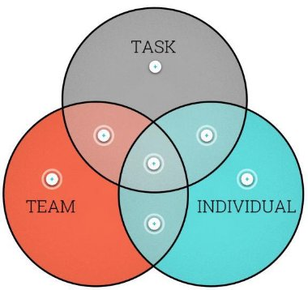

[Back to Main](../../README.md#)  
The difference between management and leadership    
    
**Manager**    
    
1\. What they do     
    
-  Follow the plan    
-  Manage performance    
-  Manage task    
-  Make sure job gets done    
-  Doing thing right    
    
**Leader**    
    
1\. What they do    
    
-  Inspire people    
-  Keep people motivated    
-  Doing the right thing    
    
## **Two types of leadership (including both management and leadership)**    
    
### 1. Transactional leadership    
    
Maintaining the normal flow of operations. Making sure things run smoothly on a day-to-day basis, focusing on task completion. Use discipline to control underperformance and a range of incentives to reward good performance.    
    
- Focus on short term success; Address small operational details quickly; Task and outcome orientated.    
-  Monitor employees' work to assess deviation from expected results; shape their approach according to the current organisation culture; based on discipline, rewards and values order over a system that promotes free thinking.    
-  Focused on KPI's measurable goals, recent job performance and best practice; reactive in its approach and follow existing rules than making changes to the structure of the business; Creates a culture of conformity and wants everything to remain the same.    
-  Has a defined structure with clear policies, procedures, standards and rules; Inflexible in its approach; frustrate employees who like to create and innovate. Seen as controlling in its approach, which can hamper performance improvement. Motivation and scope for development in its employees.    
-  Ideal for tasks that need to be done in a systematic, structured way. It works if employees are motivated by rewards and like being told what to do.     
    
    
### 2. Transformational leadership    
    
This goes beyond managing day-to-day operations and develops strategies for taking the team to a higher level of performance. It is concerned with progress and development and focuses on team-building, motivation and collaboration between employees. Accomplish goals and deliver change for the better    
    
- Focuses on long term success, getting people and systems in place for future growth; challenges the status quo and more future orientated; focus on motivating and engaging followers with a vision of the future.    
- Works well where change and initiative is encourages; set goals and offers support to push employees to higher performance level while providing them with opportunities for personal and professional growth; Encourage  new ideas and free thinking that transform the organisation.    
- A shared vision for the future that will include the whole organisation. Proactive in its approach; promote creative and innovative ideas to solve problems; develops a culture of collaboration and will work to change the organisational culture by implementing new ideas.    
- Overlook key details that affect the overall success of the organisation. If employees are not hearing, understanding, felling or connecting with the vision, they may be resistant, which could lead to failure in engaging and delivering the future vision.    
- Ideal when organisational change is required. It needs a conscious effort from leaders and managers to create a positive culture that builds trust and motivates individuals to look beyond self.     
    
## Leadership Continuum    
    
    
    
    
    
    
### Autocratic    
The more autocratic behaviours are used by leaders who want to keep control, and they must provide absolute clarity to ensure they get what they want.    
    
- **PROs**    
	- In the short term this can help to simply get the job done, perhaps to a short deadline    
	- Clarity might be exactly what some people want from you, particularly if they have limited experience.    
- **CONs**    
	- Risks suppressing any creativity or engagement from team members. They might have better ideas that you'll never hear about    
	- Demotivating, likely to reduce sense of achievement for anyone who is experienced in their role.    
### Consultative    
The more consultative behaviours are used by leaders who want to engage team members but retain control.    
    
- **PROs**    
	- People feel involved but not ultimately responsible    
	- Get the ideas and inputs you need to drive innovation without losing control    
- **CONs**    
	- Still takes time to discuss, consider other people's ideas and provide feedback    
	- If you don't incorporate other people's views they may see this approach as a sham, autocratic leadership in disguise.    
    
### Democratic    
The more democratic behaviours are sued by leaders who want to leverage the power of collective innovation, and they must provide space for debate and be prepared to let consensus win the day.     
    
- **PROs**    
	- Increased creativity and innovation    
	- High levels of engagement and motivation for those who seek autonomy    
	- Promotes teamworking which increases morale    
	- Develops people by stretching them    
- **CONs**    
	- Takes time to discuss and debate, risky for short deadlines    
	- Demotivating for people who are less experienced or need greater clarity    
	- Handing over power but still holding responsibility takes guts    
    
    
    
## Action centred Leadership    
    
- **Completion of task**    
- **Supporting individual**    
- **Managing your team**    
    
**ACTION:** write down a list of thing you plan to do in your working week. Check with Action Centred model.    
    
### Action focus     
    
    
    
#### **Balance**    
    
Ideally, activities are balanced to meet the needs of the task, the team and the individuals. This is what is known as ==**Action Centred Leadership**==    
    
    
#### **Task only**     
The needs of the task are often the most urgent and demonstrable. Often it is necessary to prioritise them    
    
- **PROs**    
	- Achievements can be morale building for the team and motivational for the individual.    
- **CONs**    
	- Too much emphasis on task needs can negatively impact the team and individual development    
	    
#### **Task - Team overlap only**    
Neglecting individual needs can eventually start to  Neglecting team needs can eventually reduce negatively impact the team spirit and inhibit  the ability of the team to meet the needs of performance against the task the task and impact individual satisfaction    
    
    
#### **Team only**    
Raising morale and ensuring a good team dynamic is desirable.    
    
- **PROs**     
	- Team cohesion enhances communication  development needs.    
- **CONs**     
	- Too much emphasis on the team can  performance and promotes distract resource from the task and any  personal development.    
    
#### **Team - Individual overlap only**    
Neglecting the needs of the task is likely to result in a loss of individual and team motivation and satisfaction as people want to feel that they can successfully deliver    
    
#### **Individual only**    
Recognition of individual contributions and development needs    
    
 - **PROs**    
	 - Enhances individual performance and promotes personal development    
 - **CONs**    
	- Can distract form more pressing tasks    
    
#### **Task - Individual overlap only**    
Neglecting team needs can eventually reduce the ability of the team to meet the needs of the task and impact individual satisfactory.     
    
    
### [Leadership Approach](./Leadership%2520Approach.md#)    
    
    
    
**Competence**    
	This is the capability of the individual to do the job or complete the task at hand. Typically competence will naturally grow over time as people gain more experience in the job.    
    
**Commitment**    
	The level of commitment to leadership ma vary over time, typically starting high and reducing before growing again as the individual gains more intrinsic motivation from the responsibility and trust they are afforded.     
    
**Directive behaviour**    
	Directive behaviour involves being clear about what is to be done. If this is done at a detailed level, this will be instructional. If this is done at a high level, this will become delegation.    
    
**Supportive behaviour**    
	Supportive behaviour involves two-way communication, listening to people and understand their views before acting. This kind of behaviour helps people to develop their capability and confidence.     
    
#### Instruct    
This is detailed directive behaviour, showing people how to do a job, not just telling them what to do.     
As a leader, this means taking responsibility for detailed decision making.     
    
#### Advice    
This is a phase where confidence is growing and commitment may be diminishing. An effective leader will provide more support to help Individuals make the right choices to ensure performance.     
    
#### Coach     
As individuals grow further in capability, they need input from the leader but would be demotivated by too much direction or advice. Good leader will take the time to participate in decision making.     
    
#### Delegate     
If you known and individual is capable of handling a task, you can provide high-level direction to let them know what it is and then leave them to do it. They can decide how to get the job done without being micro managed.     
    
### My style    
    
    
## Delegation skills    
    
When you delegate tasks, accountability stays with you    
    
### **How to delegate tasks**    
    
1. Choose the person and task    
	- Choose an individual who would benefit from developing their skills in a particular area, and select a task that is suited to them.    
	- If task accomplishment is the main objective, choose the task first then match it to an individual with the right skills    
2. Define the scope    
	 - Define the scope of the task if the individual you are delegating to is happy taking on the responsibility.    
	 - Explain how much authority and responsibility you as the task owner are giving up    
3. Train, advise and coach    
	- Provide instruction, advice or coaching for tasks they are unfamiliar with- Use your knowledge of the individual's experience, skills and competences, to decide how much support is needed. Here goes back to the last page    
4. Inform others    
	- Tell other people what authority they are giving the person they have delegated to. (if they are authorised to sign orders on your behalf or place costs against a project, you need to inform the appropriate staff.)    
5. Agree targets    
	- Discuss and agree targets such as standards and deadlines for key deliverables    
	- Ensure agreed objectives are SMART (Specific, Measurable, Achievable, Relevant, Time- bound), wherever possible    
6. Let go, but be available    
	- Once you have discussed the task and agreed targets you have to hand over responsibility to the individual you have delegated it to.    
	- Try not to end up micro-managing, this is essential if you want to free up your time.    
	- Ensure the individual knows how to contact you in case they need further clarification or run into problems.    
7. Monitor at pre-arranged times    
	- Agree review meetings, whether these are formal or informal, to discuss progress and any issues arising.    
	- Coach the individual if there are any problems, rather than taking over completely.    
8. Praise and select the next task    
	- Recognise when an individual has successfully completed a delegated task to the agreed standards and timeframes.    
	- Look for further opportunities to utilise their new skills and develop others in the team    
    
    
## Practice of Exemplary Leadership    
    
### **Model the way**    
    
- Clarify values -- by defining shared behavioural standards    
- Set the example -- by behaving in ways that reflect the shared values. Your credibility will be enhanced if you both 'talk the talk' and 'walk the walk'    
    
### **Inspire a shared vision**    
    
- Envision the future -- by creating an ideal and compelling image. If it's clear and believable to you, it will be easier to communicate. Tell stories and give tangible examples to illustrate how the vision can become reality.    
- Enlist others -- by appealing to their values, interests, hopes and dreams. Use powerful, evocative language to motivate and inspire.    
    
### **Challenge the process**    
    
- Search for opportunities -- by thinking critically and creatively. People will gain confidence if you're seen to be actively trying to change, grow, innovate and improve.    
- Experiment and take risks -- test the status quo, is there a better way? Learn from any mistakes, but don’t just ignore rules you expect others to follow.    
    
### **Enable others to act**    
    
- Foster collaboration -- cultivate a 'team' mentality by promoting cooperative goals and building trust. Actively work with people, so they feel valued and able to contribute.    
- Strengthen others -- empower and enable meaningful contributions by ensuring people feel listened to, trusted and capable    
    
### **Encourage the heart**    
    
- Recognise contributions -- individual contributions should not go unnoticed. Noticing when people do a good job and showing appreciation will help people to feel proud of their work.    
- Celebrate the value and victories -- acknowledging key events and milestones will help maintain a communal sense of positive engagement.    
    
## Leadership styles    
    
    
    
    
## Agile leadership    
    
### **Commitment**    
    
Agile leaders recognise the power of intrinsic motivation and nurture the naturally occurring drive and enthusiasm of their team.    
    
- Inspiring    
	- People look for meaning and purpose in their work life, help them to find it    
	- Try to connect the vision of the organisation to the opportunity for the individual    
	- Inspiration and motivation is infectious, so be open about the opportunities that inspire you    
- Engaging    
	- Engage people actively, taking time to listen to individuals as well as the overall voice of the team    
	- Recognise the importance of emotion in people's experience of work    
	- If you want to get the best out of people help them to feel emotionally safe and supported    
- Unifying    
	- If you have a strong culture to define how things are done, you can let people decide what gets done for themselves    
	- It's easier to empower and inspire people if they share a vision    
    
### **Communication**     
    
Agile leaders need to communicate effectively and considerately. This means listening and clarifying (rather than telling) and promoting learning by asking challenging questions    
    
- Developing    
	- Lead by example -- first develop the behaviours you want to see in yourself, then demonstrate those behaviours visibly to others    
	- Be humble -- good leaders don’t need to have all the answers    
- Reflecting    
	- Review problems from several angles by asking for other people's perspectives    
	- Analyse the data, but then go and see what's happening for yourself    
	- Give yourself thinking time for important decisions    
- Learning    
	- Actively ask for feedback and respond to suggestions    
	- Provide feedback immediately whenever possible, acknowledging progress, not just outcomes    
	- Get into the habit of noticing the good things you see and feeding back on them whenever you can    
    
### **Collaboration**    
    
Agile leaders foster cultures and working practices that help the whole team become more than the sum of its parts    
    
- Empowering    
	- People work best and are more intrinsically motivated when they feel ownership of their work    
	- Empowering people don't mean abdicating responsibility. Provide the right level of support for the individual and the situation    
- Achieving    
	- Collaborative communities achieve more than individuals    
	- Provide teams with the tools they need to operate efficiently, and the autonomy to operate within their boundaries.    
- Innovating    
	- Innovation won't happen in a culture of fear, stress and control.    
	- Be open to influence from anyone in your organisation    
	- Encourage a continuous flow of ideas, even if most are not used immediately    
    
    
## Motivate and Hygiene factors    
    
### Hygiene factors    
    
- **Do**:      
	- Reduce job dissatisfaction     
	- Give people less to dislike about a job     
- **Don't**     
	- Increase job satisfaction     
	- Give people reasons to feel motivated dislike about a job    
- **Examples**     
	- Working conditions     
	- Co-worker relationships    
	- Policies and rules     
	- Quality of supervision     
	- salary    
    
### Motivators    
    
- **Do**:      
	- Provide feelings of satisfaction    
	- Motivate people    
- **Don't**     
	- Cause people to be dissatisfied    
	- Affect what people dislike about a job    
- **Examples**     
	- Achievement    
	- Recognition     
	- Responsibility     
	- Advancement     
	- Personal development    
	- The work itself    
    
    
    
    
**Autonomy**    
We are more engaged when we have the freedom to choose what we do, when, how, and with whom. Outdated views of "management" as controlling and monitoring rather than enabling and clarifying are barrier to autonomy, which is a key condition for intrinsic motivation.    
    
**Mastery**    
    
Getting better at what we do is naturally satisfying. We attain mastery when we develop a sense of flow, where the challenges we face are perfectly matched to out abilities. A sense of mastery generates satisfying positive experiences that build confidence and increase motivation.    
    
**Purpose**    
    
A sense of purpose is very powerful in building motivation, whether that's being part of team, or making a contribution to society as a whole. Effective leaders build a common sense of purpose by finding ways to translate business goals in ways that align to people's values and aspirations.    
