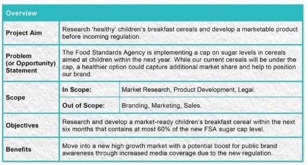
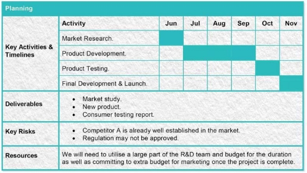
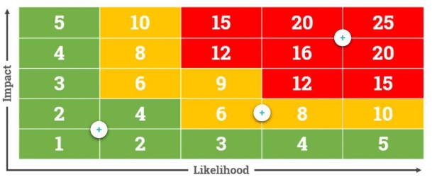

## Core Principle    
    
    
### Define a project    
---     
1. To be planned, so all team member are clear about the activity    
2. Set out goals.    
3. Clear priority of constraints to the scope, quality, cost and time.    
4. To involve people and resources    
5. To create unique and beneficial change    
6. To have a beginning and an end    
    
    
### Project Life Cycle    
---    
    
1. Scope    
	1. Cost vs. benefits    
2. Plan    
	1. Timing with outline milestones and dependencies    
	2. Resources for staff, equipment and materials    
	3. Finance income and expenditure throughout the project life cycle    
	4. Quality targets and controls    
	5. Acceptance criteria for accepting deliverables    
3. Implement    
	- Monitoring the progress against the plan    
			Costs are being committed. Changes at this stage are likely to mean rework, resulting in more costs.    
    
4. Review    
	- Final project report will formally close the project, handing over deliverables.     
	- Project review determines the success of the project against the objectives, outlining lessons learned    
### Constraints    
1. Cost    
2. Scope    
3. Time    
4. Quality    
    
### SMART Objectives    
1. Specific     
	- Specify exactly what needs to be achieved. We know what we want to achieve and why    
2. Measurable     
	- Define what success looks like and how it will be measured. We know what success looks like.    
3. Achievable     
	- Think about how the objective is going to be achieved - is it realistic? They are challenging but realistic.    
4. Relevant     
	- Choose something that you can affect, which aligns with business goals/the big picture. They contribute to our overall goals    
5.  Time-bound    
	- Set a realistic deadline/time-frame with just enough pressure to maintain motivation. There is a clear deadline    
    
    
## [Engaging stake holders](./Engaging%2520stake%2520holders.md#)    
    
    
    
## [Project initiation](obsidian://open?vault=Personal_Note_Library&file=Management%2Fform%2FPID%20template.docx) as transition from scoping to planning    
### 1. Overview    
- **Project Aim**: What's the overall aim of the project? How will the world be different if the project goes ahead    
- **Problem**: what is the problem that needs solving. The key is to ensure stakeholders understand why the project exists when they sign up to it.    
- **Scope**: The limits of the project. It could be in terms of organisation, time or locations. Could also define key aspects that are out of scope for clarification.    
- **Objectives**: these are the outcomes the project will accomplish. They will be the measures of success at the end of the project. Use SMART objectives for this    
- **Benefits**: the lasting impact for the organisation. Consider quantitative and qualitative impacts. It's ok if these are estimates at this stage.    
    
    
    
### 2. Planning    
- Key activities and timelines: outline the key phases or activities, then estimate how long will each phase or activity takes. This will be a basis for more detailed planning in the next phase    
- Deliverables: This may include supporting deliverables such as training or communications materials.    
- Key Risks: Identify the top level potential barriers to success, these could also be factors external to the project. Risks will be analysed in much more detail later in the process.    
- Resources: what are the inputs required to deliver this project in terms of finances, expertise and perhaps physical assets.     
```custom-frames    
frame: project plan    
```    
    
    
    
### 3. People    
    
- **Sponsor:** this person should raise the profile of the project and be prepared to use their authority to support implementation    
- **Stakeholders**: taken from stakeholder mapping exercise    
- **Project Team**: the people tasked with delivering the project, including key contractors if appropriate. This could include names and roles if appropriate    
    
    
    
    
## Evaluation and [Finance](./Finance.md#)    
    
### Benefits    
    
You need to be clear about the benefits that your project is aiming to deliver and provide an accurate view of what the costs will be. These costs and benefits don’t necessarily have to be financial, But they should be measurable.    
    
 [Balanced score card](obsidian://open?vault=Personal_Note_Library&file=Management%2Fform%2Fbalanced%20scoredcard%20template.docx) to sort out benefit and cost    
    
### Financial evaluation    
1. Upfront costs     
	- Include all scoping, planning, implementation and project review costs    
2.  Ongoing costs     
	- Must include the elements being changed by the project and will continue to accrue for as long as the solution operates    
3.  Benefits    
	- Monetary values. Ongoing costs will be deducted from the benefits to calculate the net cash flow    
    
### Achieving greater accuracy    
1. Simple payback    
2. [Discounted payback](obsidian://open?vault=Personal_Note_Library&file=Management%2Fform%2Fpayback%20calculation%20tool.xlsx)    
	- Include the discount on currency.     
    
## Managing for success    
    
**4 key considerations and critical success factors**    
    
### Critical Success Factors    
    
What needs to happen or be in place to support your project. **If one of these CSFs is not in place, record this as high priority risk and work with stakeholders to mitigate the risk before progressing with implementation.**    
    
1. Senior management buy-in/sponsorship     
	* They don’t need to be concerned by the details, but they do need to have a strong drive to see the project succeed, and the authority to make it happen    
2. Stakeholder Engagement     
	* Take the [stakeholder map](obsidian://open?vault=Personal_Note_Library&file=Management%2Fform%2FStake%20holder%20mapping%20tool.xlsx), have a plan for engaging and communicating with stakeholders.  Different stakeholders have different needs. Be especially sure to manage those who have high interest and influence.    
3. Clarity of scope and objectives     
	* Scope & Objectives will be documented in your project initiation document.  Regularly communicating what is and what isn't planned to be achieved with stakeholders is always good practice for project managers.    
4. Resources and Budgets     
	- Identify each of the resource elements separately and ensure senior stakeholders are clear about their responsibilities to ensure these CSFs are in place.    
5. Competence     
	- You need to be confident that they have adequate skills and experience to deliver/ competence could be anything from management to technical skills, and may include contractors and suppliers as well as internal resources.    
6. Management of Environmental Factors    
	- Conduct a PESTLE analysis to review the political, economic, social technological, legal and environmental factors.     
    
### [Stakeholder impact](obsidian://open?vault=Personal_Note_Library&file=Management%2Fform%2Fimpact%20assessment.xlsx)    
    
How will you support people who will be impacted by your project, to deliver ongoing benefits?    
    
1. Define stakeholders who will be affected    
2. Compare the changes to people who will be affected     
3. Assess the impact    
4. Analyse the impact    
5. Supporting transition    
	1) 1-way communication for large populations and less affected people    
		1) Internal memos    
		2) Emails    
		3) Press-releases    
		4) Message from a senior stakeholder    
	2) 2-way engagement encourage questions and answers, beneficial for those who are more significantly impacted    
		1) Team briefings    
		2) Participative status meeting    
		3) Seminars    
	3) Training/Learning to bring individuals up-to-speed with the new way of working    
		1) Skills workshops    
		2) e-learning    
		3) User manual    
		4) Process documents    
	4) Leadership support if an individual's role is significantly impacted by a change    
		1) Mentoring    
		2) One-to-ones    
		3) Workload management    
    
### Key performance indicators (KPI)    
    
How will you continuously measure progress towards your goal?     
    
As your project progresses, you will need to have the ability to provide a high level view of how well things are going. These are ongoing measures of project performance.    
    
1. Stakeholder satisfaction    
	- When a project goes live, any issues raised by stakeholders should be documented and managed (You can use the attached tools to do this).    
	- Set targets for:    
		- Number of live issues raised    
		- Average time taken to resolve issues    
    
2. Budget    
	- How much budget has been spent compared to the plan. You will find out more about how to plan and measure variance to budget in detail in **module 6**.    
	- Set targets for:    
		- Overall monthly/weekly spend    
		- Spend on key controllable items, for example consultants or contractors    
3. Effort    
	- How much effort, typically in terms of people’s time has been spent compared to the plan.    
	- Set Targets for:    
		- Percentage of time taken to complete tasks compared to planned time. However, this requires accurate data about how much effort people are putting into which tasks    
4. Delivery on time    
    
	- What proportion of tasks and deliverables have been completed on time as planned.    
    
	- Set Targets for:    
    
		- Percentage of tasks completed by their due date, as broken down in your plan    
		- More importantly, Milestones delivered on time. Milestones represent the delivery of whole phases of a project. (You’ll find out more about these in **Module X**)    
    
### Risks    
    
What could cause problems or completely derail your project? A team brainstorm of all the potential risks will help you to identify them.    
    
1. Typical risks    
	1) Lack of senior stakeholder commitment    
	2) Late delivery by suppliers    
	3) Overambitious objectives    
	4) Changes in market conditions    
	5) Equipment failure    
	6) Illness    
2. [Risk assessment](obsidian://open?vault=Personal_Note_Library&file=Management%2Fform%2FProject%20risk%20assessment.xlsx)    
	1) Identify risks     
		- Constructing the risk matrix by listing all possible risks to project.    
	2) Describe impact     
		- Will it impact one or more of scope, time, quality or cost. You could also identify KPIs or Milestones that you would expect to be impacted.     
	3) Rate likelihood     
		- How likely would it occur. Use data if available.     
	4) Rate impact     
		- Consider the importance fo the impacted constrains and milestones    
	5) Calculate risk     
		- Calculate the total risk score for each risk you've identified, simply by multiplying the likelihood score by impact score.    
	6) Apply common sense     
		- Adjust impact score    
	7) Appetite for risk    
		- Decide what level of risk is acceptable to the project by defining what your critical score will be. This is the score above which you will take action    
    
    
    
3. Solution to critical score    
	1) Eliminate     
		- Altering some aspect of your project    
	2) Minimise     
		- Put something in place that reduces the impact of the risk or the likelihood that it will happen    
	3) Transfer     
		- Passing the risk on to a third party    
	4) Accept    
		- Impossible to guard against a risk    
    
    
## Project Planning    
### Work Breakdown Structure    
    
If have no idea, use stand 4 phase project life cycle: scope plan, implement, review & close    
    
1. **Complete** listing all the tasks needed to complete a project    
2. **Hierarchical** showing how they related to each other    
3. **Mutually Exclusive** there should be no duplication    
4. **Work-based** listing tasks as opposed to deliverables or outcomes    
5. **Granular** to a level of detail appropriate to your project    
    
### Gantt Charts    
    
Include Resource allocation (person), Milestone (not small ones), Dependency, Client meeting -- can only happen in the morning    
    
1. Sequencing tasks    
2. Define critical path of the project    
3. Optimising resource    
4. Adjust float time    
5. Set milestones    
    
    
#### Milestone    
    
1. Important, timebound, involve an element of risk    
2. Monitor progress    
3. Goal based. It signify the achievement of a goal     
4. Visible. They should be clear and meaningful to the project team and give a concise overview of key dates and dependencies    
5. Instructive. Identifying milestones helps to define the tasks needed to meet them and the capabilities required to perform the tasks    
    
#### Dependencies    
    
It is based on logic, resourcing and occasionally discretionary factor    
    
1. Start--start     
	- Start dependencies Task B can not start until Task A has started    
2. Finish--start     
	- The most common type of dependency in which Task A must finish before B can start    
3. Finish -- Finish     
	- Tasks can happen simultaneously but Task B can only finish once Task A has finished    
4. Start -- Finish    
	- Task B can only finish after Task A has started    
    
#### Process mapping    
    
1. Top down    
2. Simple    
3. Swim lane    
    
    
## Project Implementation    
    
### RACI    
    
1. Who is **Responsible**    
    
	- This person has responsibility for ensuring the task is completed or the decision is made. They are the person doing the task. Only one person should be responsible for a task. If a task seems to warrant multiple R's it may be better to split it into subtasks to separate responsibilities to individuals.    
    
2. Who is **Accountable**    
    
	- This person will ensure expectations are met when completing the task/making the decision. The buck ultimately stops with them. As project Manager, you don’t want to be accountable for everything. There must be one A for east task, no more or no less    
    
3. Who needs to be **Consulted**    
    
	- These stakeholders must be consulted before a task can start. They require two-way communication .They provide information  or authority to proceed.  They are often subject experts or in senior roles. Too many Cs can slow down a project    
    
4. Who should be kept **Informed**    
    
	- These stakeholders only need one-way communication. They should be kept up-to-date on tasks where they are affected by the outcome. Too many Is could become a reporting burden.    
    
5. How to make a[ RACI matrix](file:///C:/Users/yl720/Google%20Drive/Management%20Course/project%20planning/RACI%20matrix.xlsx)    
	1. List all tasks need to deliver the project    
	2. List all people/role    
	3. Fill in the RACI matrix by identifying roles.    
    
    
### Managing project meeting    
    
1. Set the ground rules     
	- Establish meeting rule at the start of your project to encourage everyone's full and focused participation. This will encourage people to share information, remain objective and collaborate to make informed decisions.    
2. Create an[ agenda](obsidian://open?vault=Personal_Note_Library&file=Management%2Fform%2FPM%20meeting%20Agenda.docx)    
	1. An agenda is critical to the success of a meeting. It spells out its purpose and who needs to attend to achieve that purpose    
	2. The meeting's purpose is split into points of discussion as agenda items. Have a realistic allowance and assign responsibility for reach point.    
	3. Issue the agenda in advance to tell people when and where the meeting is, so they arrive prepared and on time.    
3. Timing is everything    
	1. Manage discussion so agenda items run on time and you finish on schedule    
	2. Have a flip chart to make note of any points that go off-track. This way people won't feel that their point is being dismissed and repeat interruptions can be avoided. You can address these items at the end or outside of the meeting.    
4. During the meeting recap    
	1. When agreements are reached, summarise to check everyone is clear before moving on    
	2. At the end of the meeting, summarise the accomplishments and assign actions to an owner.    
5. Follow up the meeting     
	1. Circulate the meeting's conclusions and actions as soon as you can after the meeting    
	2. Allocate actions to specific individuals and they are more likely to be done.    
    
### Cashflow Variance Analysis    
    
1. Create rows for each area of income and expenditure    
2. Create columns for each month: Budget and Expenditures and Variance    
3. Keep data up to date, understand the reasons for variances and adjust where necessary    
    
    
### Review & Handover    
1. Project Goals    
	1. Were all project goals, objectives & deliverables outlined in your project initiation document(PID) achieved?    
	2. Did the goalposts move    
	3. Are there any outstanding items    
	4. Was the client happy with the product/end result    
2. Resources    
	1. Did you make economic, efficient and effective use of resources such as people, equipment and facilities?    
	2. Were there areas that were over or under-resourced?    
	3. Was enough time allocated to tasks to deliver them to schedule?    
3. People    
	1. How did you manage the various members of your project team?    
	2. Did you have the skills and expertise you needed to complete the project successfully?    
	3. Did you project provide people with development opportunities?    
	4. Was communication always effective? If not, how did this affect the project and how could it be improved in future projects    
4. Stakeholders    
	1. Did you accurately identify all stakeholders and manage the relationships effectively?    
	2. What feedback did you receive from stakeholders?    
	3. Did your impact assessment help you to support stakeholders to successfully transition to the change you delivered?    
5. Risks    
	1. Did you identify and manage project risks effectively?    
	2. Were there any unforeseen circumstances to watch out for next time?    
6. In summary    
	1. Your project review should be documented and made accessible to your project team, sponsor and other project managers.    
	2. Include a copy of your PID with your review document     
	3. Your project review will ensure lessons are shared and any outstanding items are followed up    
    
