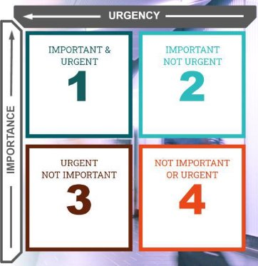

[Back to Main](../../index.md#)  
## Resource wheel    
    
### 6 key business resources    
    
- People    
	- Director and management team    
	- Customer service staff    
	- Operators    
	- Technical experts    
	- Contractors    
- Equipment    
	- Tools and production line equipment    
	- IT/Communications hardware    
	- Safety Apparatus    
	- Hired machinery    
- Materials     
	- Natural resources and mined materials    
	- Office stationary    
	- Raw ingredient    
	- Items kept as stock    
- Time    
	- Management time    
	- Available employee hours    
	- Process duration (e.g. procurement)    
	- Business cycles & forward planning    
- Information    
	- Information systems    
	- Intellectually property    
	- Website/data/e-commerce    
	- Consumer data    
- Facilities    
	- Production sites    
	- Offices    
	- Distribution sites    
	- Sales and service centre    
    
The one integrating component of the resource wheel is money. All the others require finances to make them available to an organisation.     
    
### The three Es of the resource    
    
- Effective Ent    
- Economy     
- efficiency    
    
    
## The important & urgent    
    
    
    
    
    
    
**Urgency**: when assessing the urgency of tasks    
- Ask yourself, how valuable will delivery of the task be if it's not on time? If the answer is "not at all valuable", then the task is not urgent.     
- Remember that urgent tasks often rise to the top of the list at the expense of important tasks.    
    
**Importance**: when assessing the importance of tasks.    
- Ask yourself, if this does not happen, will it be a significant problem? If the answer is "No", perhaps it's not that important.     
- Remember that important tasks should be focused on delivering clear value to the organisation.     
    
### Important and urgent    
- Planned action that are restricted to specific time frames, such as producing reports based on up to date data. Things that we simply have to accept.     
- Unplanned firefighting of problems that will have a major impact on costs, customers, or the ability to deliver organisational plans.     
**Solution: Do or Delegate**    
- If these are reasonable planned activities they should justifiably be the top of the list. You could however look at opportunities to delegate to a colleague.     
- If this is a regular task, try to create time to tackle the root causes of the problems. If it really is important, it will be best handled if it's not urgent.     
    
### Important, not urgent    
- Planned activities such as personal development, building and maintaining relationships, and seeking opportunities for innovation and problem solving.     
- These activities often get pushed back because they feel less urgent, or require space for quality thinking.     
**Solution: Do more, Do often**    
- These are the activities that the most effective people will prioritise wherever possible, delivering impartments, fixing root causes, and maximising the long-term value of their time.     
- These tasks can often seem daunting, so be aware of any time you feel that something is "too difficult". Make sure to give yourself adequate time to focus an degenerate momentum, and seek support.    
    
### Urgent, not important     
- This can include interruptions such as phone calls, or e-mails from colleagues who need support. It could also include diarised regular activities such as meetings that offer limited value     
- These are the activities that can often push back more important work    
**Solution: Delegate or Dodge**    
- These are the activities that are most likely to prevent us from being effective in the longer-term. If the task is easily within your capability, ask yourself what your true motivations are for doing it yourself rather than delegating it.     
- The key is to delegate where you can, or if the activity is not within the scope of your responsibility, to sensitively and assertively saying "no"    
    
### Neither important or urgent    
- These are probably distractions, such as continuing to surf internet content after you've found the information you really need, or trying to solve a problem in a new way, when you already have a viable work around.     
- This is the realm of procrastination.    
    
**Solution: Dodge or Discover**    
- If you are setting these tasks for yourself, take some time to reflect on your motivation and confidence to tackle the more important tasks.     
- However, the surprising truth is that sometimes allowing ourselves a little time to follow our natural curiosity can lead to new discoveries and innovations.    
## Managing meetings    
    
Meeting should make people feel energised and motivated. They should see the opportunities ahead of them.    
    
Key to successful meeting: **Clarity and Focus.**     
    
1. Why the meeting matters?    
2. Why they are there?    
3. What’s their role in the group?    
4. When is it and where?    
5. What will we cover?    
    
**25% of meeting planning     
50% of actual meeting**    
**25% of following up actions**    
    
- [Setting-the-agenda](./Setting-the-agenda.md#)    
    
### Good meeting behaviours    
    
- **State views and ask genuine questions**    
    
Being open about our views and asking genuine questions, which stem     
    
from **curiosity** rather than a desire to influence others, helps to increase understanding. from**curiosity** rather than a desire to influence others, helps to increase understanding. This is an important prerequisite for**effective collaboration.**    
    
- **Share all relevant information…**    
    
It’s important to avoid the temptation to share only the information which supports our preferred solution to a problem. We should aim to reach a shared understanding of a given situation to support **informed decision-making**.    
    
- **Use specific examples and agree what important words mean…**    
    
Miscommunication is a common barrier to efficiency in meetings, so it’s important that we use **illustrative examples** where appropriate and clarify how we are using **key terms**. This ensures everyone is on the same page.    
    
- **Explain reasoning and intent…**    
    
We all search for meaning in people’s actions and make assumptions about their intentions, which can be inaccurate. Explaining our reasoning and intent is an effective way to state our views and minimise the potential for **misinterpretation**.    
    
- **Focus on interests, not positions…**    
    
People are natural problem-solvers, but we often prioritise our own interests when presenting our position on an issue. If we start by **establishing collective interests** in a solution, we can work together to arrive at more agreeable outcomes.    
    
- **Test assumptions and inferences…**    
    
When we’re at risk of making assumptions or drawing our own conclusions, it’s important to seek **confirmation of understanding**. By taking accountability for the accuracy of our thinking, we can ensure our contributions are constructive.    
    
- **Jointly design next steps…**    
    
Next steps or follow-up actions should be agreed and assigned **jointly**, allowing everyone the opportunity to express their views or concerns as appropriate. This ensures wider **commitment** to the course of action and individual roles.    
    
- **Discuss ‘undiscussable’ issues…**    
    
‘Undiscussable’ issues are those we tend to avoid due to a fear they will cause others to feel embarrassed or defensive. As long as discussions remain **transparent**, **curious**, and **compassionate**, however, it’s still important for us to discuss the difficult topics and ensure any issues are dealt with.    
    
## [Leadership-Approach](./Leadership-Approach.md#)