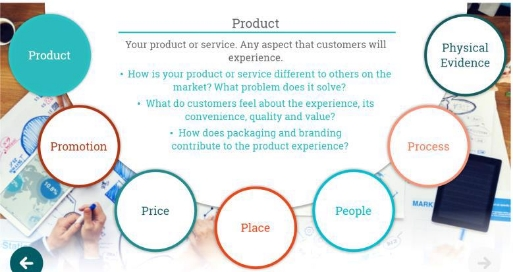
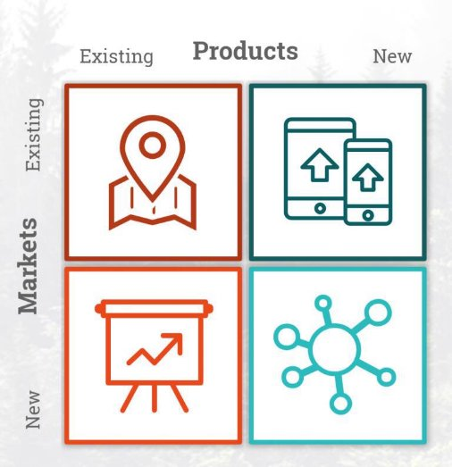
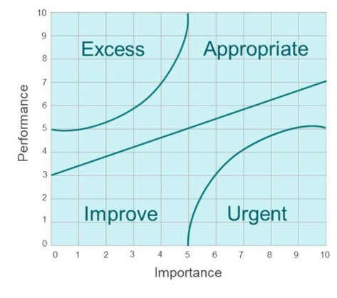

[Back to Main](../../index.md#)  
## Structure of SWOT and case study    
    
    
    
1. Check OT for PESTLE    
2. Transfer key points from PESTLE to OT in SWOT.    
3. Trying SW, some might fit the elements in 7S . It will help identify the SW.     
    
## [PESTLE analysis](obsidian://open?vault=Personal_Note_Library&file=Management%2Fform%2FSimplePESTLE.docx)(external for OT in SWOT)    
    
### **Political**    
    
Think about the political climate, tax, international trade agreements and restrictions, and the underlying issues that drive political agendas of the day.    
    
- What is the scope of the politics that impact your business, based on your key markets, countries, and locations of your operations?    
- What level of stability or volatility is present in these areas?    
- What are the foreseeable political issues and how are theses being addressed by politicians and the media.    
    
### **Economic**     
    
Gather key macro-economic data and consider these alongside local economic issues    
    
- What are the forecasts in terms of exchange rates, economic growth, inflation and interest rates?    
- How is consumer behaviour changing in your markets?    
- How are labour markets behaving in your geographies, what are the labour costs, are key skills in ready supply or are there shortages?    
    
### **Social**    
    
Consider changes in social norms and behaviours, the cultural context could be changing in different ways in different areas or countries    
    
- What demographic shifts, such as age and life situation, are observable in key stakeholder groups, such as customers and employees?    
- How are social norms and attitudes changing?    
- What changes are there in consumer behaviour?    
    
### **Technological**    
    
Identify the technologies that are driving change, and those that could disrupt the status quo.    
    
- Which technologies are changing products and services in your industry and markets?    
- Are there emerging technologies that currently seem unrelated, but you anticipate will have an indirect impact, or an impact in years to come?    
- How are these technologies changing consumer behaviours?    
    
### **Legal**    
    
while this could be a subset of political factors, legislation has such a significant impact that it's worth considering separately.    
    
- To what extent are your markets driven by legislative requirements and how could this change in the future?    
- What key legislation drives your business processes and how might this change?    
- Consider Health & Safety, Environmental legislation, Employment low and Data. What are the risks and issues that drive legislation?    
    
### **Environmental**    
    
Think about the impacts of your business on the environment, the normal supply of resources and lifecycle of products.    
    
- What are the environmental impacts of your business in terms of carbon and waste, and the usage of energy and natural resources?    
- What are the impacts of your industry as a whole, and your businesses supply chain?    
- Are there any issues that would be difficult to deal with if exposed.     
    
### **How to use PESTLE**    
    
#### SIMPLE WORKSHOP    
    
Brainstorm the issues and gather data. If you do this in a group you can get the added benefit of bouncing ideas of each other and sharing views. This may be all you need for a temperature check of the business environment.    
    
#### STRATEGIC PLAN OR BUSINESS PLAN    
    
You could use PESTLE within a formal proposal or strategy document to record aspects of the wider environment that have informed your choices. You'will need to use other tools to understand the competitive position of the business, and you may need to gather data to back-up opinions.     
    
#### DETAILED STRATEGIC RISK ASSESSMENT    
    
If the stakes are high, you can take your analysis to the next level by assessing the risks and opportunities of each of the issues you have identified. This is particularly appropriate if you are considering large investments, or making long-term decision.     
    
## [SWOT](obsidian://open?vault=Personal_Note_Library&file=Management%2Fform%2FSWOT_Analysis_Grid.docx) and ([7S](obsidian://open?vault=Personal_Note_Library&file=Management%2Fform%2FMcKinsey7S.docx) model and 5Ps model  just SW in SWOT)     
    
    
    
- Strength    
- Weakness    
- opportunity    
- Threat     
    
    
The organisation needs to ask what's the SW in each area    
    
### 7S    
#### **Style:**    
    
The characteristics of the organisation that make it easy or difficult for outsiders or new starters to settle. **Key question:**     
    
- how do senior leaders behave and set the tone    
    
#### **Strategy**     
    
The strategy of your organisation is simply how it is planning to achieve its goals    
    
**Key question:**     
    
- how does the organisation plan to gain a competitive advantage in its markets (a series of initiatives, or a vision- based strategy that creates longer term direction)?    
    
#### **Staff**     
    
This is about the people in your organisation    
    
**Key question:**    
    
- how engaged are the workforce? Is talent retention an issue? Are people offered relevant opportunities?    
- Does the diversity of the workforce offer a range of perspectives    
    
#### **Structure**    
    
This is the organisation chart    
    
**Key questions:**    
    
- How do different business units and functions operate (centralised vs. decentralised, do they connect at high levels, or relatively junior levels)?    
- How is authority cascaded through the organisation?    
    
#### **Shared values**    
    
This aligns with the branding and mission or vision of the organisation    
    
**Key questions:**    
    
- Most businesses exist to generate shareholder value, but does your organisation also have a community or social mission, which supports the brand?    
    
#### **Skills**    
    
This is an amalgamation of peoples' skills within the organisation    
    
**Key questions:**    
    
- What technical, professional and leadership skills exist within the organisation, including those gained through outsourcing.    
- What overall organisational capabilities and knowledge exist, beyond the skills and experience of people?    
    
#### **Systems**     
    
These are the processes that drive the organisation.    
    
**Key questions:**    
    
- How mature and adaptable are processes and systems across different functions?    
- How does decision-making happen?    
    
EXAMPLE    
    
    
    
    
    
    
    
    
    
    
    
    
    
### **5Ps**    
- Products & services    
- Prices     
- promotion    
- place    
- profit & [Finance](./Finance.md#)    
    
    
## [Marketing mix](obsidian://open?vault=Personal_Note_Library&file=Management%2Fform%2FMarketingMix7P.docx) 7Ps model    
    
    
    
    
    
### The sellers mix     
- Product     
- Price    
- Place    
- Promotion     
### The buyer's mix    
-  Customer value    
-  Customer cost    
-  Convenience    
- Communication    
    
    
### **PRODUCT**    
    
Your product or service, any aspect that customers will experience.    
    
### **PROMOTION**    
    
- To what extent are you going to advertise, and through which channels? (e.g. digital/traditional media/mailshots etc.)    
- What are the target customers and which channels do they engage with?    
- Can you promote directly to existing or know potential customers?    
    
### **PRICE**    
    
Understanding the value of your product is crucial to getting the price right    
    
- How do your prices compare to your competitors?    
- What does the prices say about the value of the product - is it about right, or too low?    
- How competitive or premium is your pricing, and how does this relate to the volume and scalability of your sales?    
    
### **PLACE**    
    
How or where you make your product/service available to your customers    
    
- Do you own or control any distribution channels for selling directly to your customers?    
- What other channels could you use (e.g. wholesalers, agencies) and how will that affect profits?    
- Will your pricing strategy be adjusted to align with the distribution channel; e.g. products bought online?    
    
### **PEOPLE**    
    
Anyone in your business who has a direct impact on the product/service your offer.     
    
- What is the service culture in your organisation - are frontline service people customer focused?    
- Do your people communicate with customers in a way that supports your brand?    
- What barriers or frustrations do your people experience that prevent them from delivering a great service.     
    
### **PROCESS**    
    
Whether your customers are other businesses or consumers, your customer service processes are a critical part of the customer experience.     
    
- Whether your operate in stores, over the phone, online, through long-term contract or a mix of these, how effective are your point of sale processes?    
- Do the processes work with or against your people, what's the interrelationship?    
- What happens after the sale to generate brand loyalty?    
    
### **PHYSICAL EVIDENCE**    
    
How do you make your brand visible - e.g. transportation, billboards, website, review sites, online customer feedback?    
    
- Do your facilities, offices, reception areas or stores support or detract from your customers' experiences?    
- Where is your brand evident, from transportation and billboards, to the website or review sites and online consumer feedback?    
- Is the visible evidence of your brand consistent with your brand values?    
    
    
    
## [VMOST](./VMOST.md#)    
    
## [Pricing-strategies](./Pricing-strategies.md#)    
    
    
## 5 Forces model and case study    
    
    
**Substitutes**     
Threat of substitute products    
    
**New entrants**    
    
Threat of new entrants    
    
**Suppliers**    
    
Bargaining power of suppliers    
    
**Buyers**    
    
Bargaining power of customers    
    
**Industry competitors**    
    
    
    
    
### 5 Competitive forces    
    
[https://www.isc.hbs.edu/strategy/business-strategy/Pages/the-five-forces.aspx ](https://www.isc.hbs.edu/strategy/business-strategy/Pages/the-five-forces.aspx)    
[tools](obsidian://open?vault=Personal_Note_Library&file=Management%2Fform%2FFive_Competitive_Forces_Tool_v2.xlsx")    
    
### **New entrants**    
    
It could be new businesses, or businesses moving into a new market space.     
    
The threat of new entrants adds pressure to keep prices down and makes customer retention more difficult    
    
*Barriers to entry*    
    
- The setup or capital costs required, including capital for equipemnt    
- Brand awareness    
- Accesss to distribution channels    
- Legislative restrictions    
- Access top expertise    
    
### **Substitutes**    
    
Sustitutes are products or services that meet the same need in a new way.    
    
The threat of substitutes puts pressure on prices, makes customer retention more difficult, and could ultimately lead to the collapse of an industry    
    
*Determinants of substitution threat*    
    
- Rate of technological innovation relating to the industry    
- Relative pricing of substites    
- The cost of switching to a substitute    
    
### **Suppliers**    
    
Suppliers are businesses that provide essential goods and services to other businesses.     
    
The bargaining power of suppliers determines the ability of a business to control its input costs and term.    
    
*Determinants of Supplier Power*    
    
- Differentiation of suppliers - do they all offer similar products or services?    
- The cost of switching suppliers    
- Supplier concentration - how many suppliers are there    
- Importance to suppliers of selling high volumes.    
    
### **Buyers**    
    
Buyers are the direct customers of an industry.     
    
The bargaining power of buyers determines the ability of a business to negotiate favourable prices and payment terms with its customers    
    
*Determinants of buyer power*    
    
- Differentiation of products or services offered by your business    
- The cost of switching to a competitor    
- Number of competitors to choose from    
- Volume of demand    
- The availability of substitute products    
    
### **Industry competitors**    
    
These are the businesses competing for profit and market share within an industry.     
    
The intensity of rivalry within an industry puts pressure on businesses to lower prices or increase investment, leading to reduced profitability.    
    
investment, leading to reduced profitability.    
    
*Rivalry determinants*    
    
- Industry growth. Stagnating industries are likely to be highly competitive.    
- Differentiation of products, services, and brand identity    
- Concentration and diversity of competition    
- Variation in demand and potential for overcapacity    
- Exit barriers.    
    
## Strategy approach    
    
 [The Ansoff Matrix](https://www.youtube.com/watch?v=AORoMxgp428&feature=youtu.be)    
    
[tool](file:///C:/Users/yl720/Google%20Drive/Management%20Course/GrowthStrategiesMatrixTool.docx)    
    
    
Market development Diversification     
    
## Competitive advantage grid [(template](file:///C:/Users/yl720/Google%20Drive/Management%20Course/CompetitiveAdvantageTool.xlsx))    
    
[https://www.ifm.eng.cam.ac.uk/research/dstools/importance- performance-matrix/](https://www.ifm.eng.cam.ac.uk/research/dstools/importance-performance-matrix/)    
    
     
    
